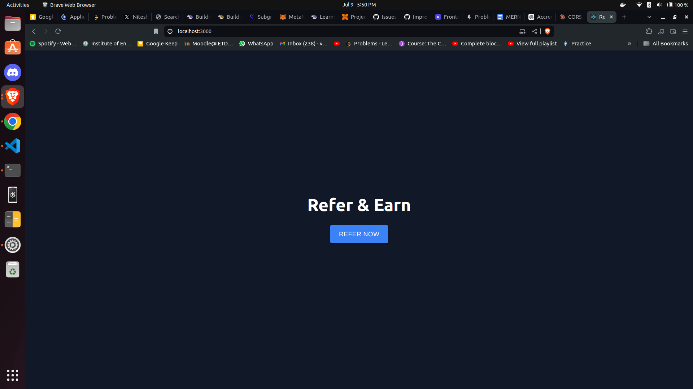
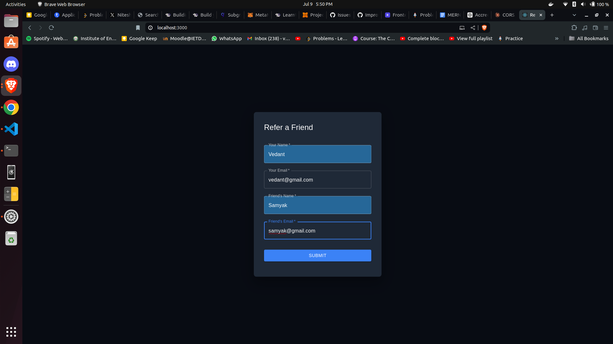
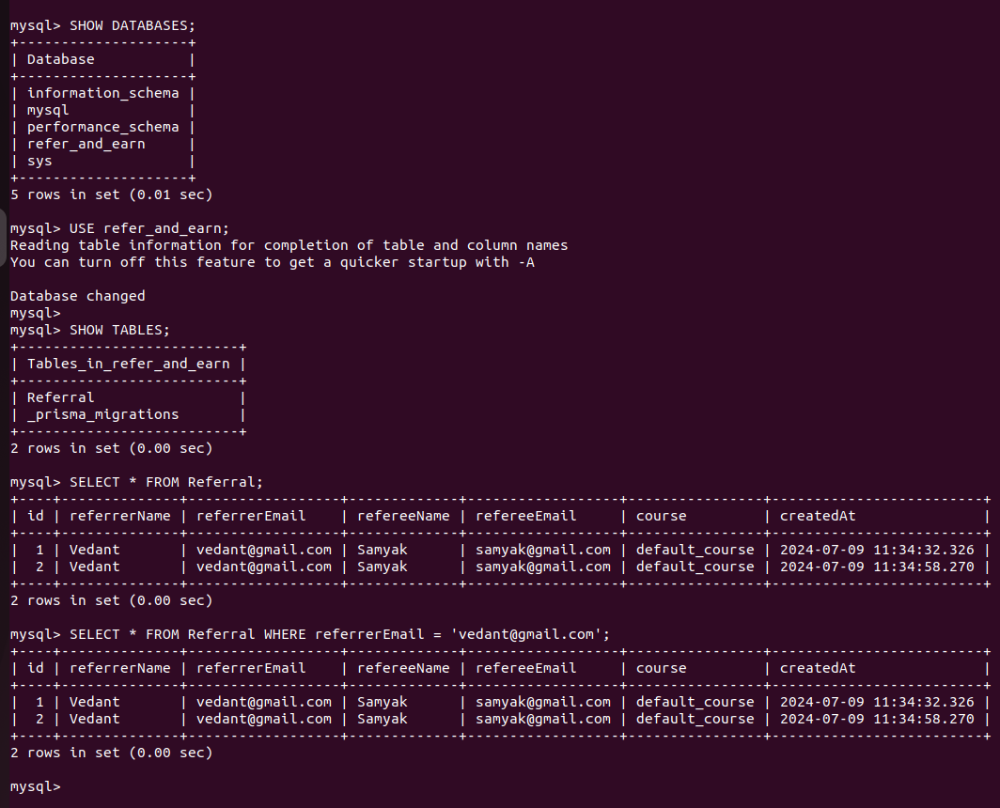

# Accredian Assignment

## Introduction
This project is a MERN (MongoDB, Express.js, React.js, Node.js) Full Stack application for a Refer & Earn landing page. It allows users to refer a course to their friends through a user-friendly interface.

## Features
- **Frontend**: Built with React.js, featuring a responsive and intuitive UI.
- **Backend**: RESTful API developed with Node.js and Express.js, integrated with Prisma ORM for MySQL database connectivity.
- **Database**: MySQL used to store referral data.
- **Email Integration**: Google Mail Service API for sending referral emails upon successful submission.
- **Form Validation**: Implemented to ensure all required fields are filled before submission.

## Installation

### Prerequisites
Before starting, make sure you have the following installed:
- Node.js (version 14 or above)
- npm (Node Package Manager)
- MySQL database

### Steps to Setup

1. **Clone the repository**
   ```bash
   git clone https://github.com/Vedantjn/accredian-assignment
   cd refer-and-earn

2. **Backend Setup**

- Navigate to the backend directory:
    ```bash
    cd backend
- Install dependencies:
    ```bash
    npm install
- Create a .env file based on .env.example and configure MySQL database connection details.

3. **Database Setup**

- Create a MySQL database named refer_and_earn.
- Run Prisma migrations to create tables in the database:
    ```bash
    npx prisma migrate dev

4. **Start Backend Server**

- Start the backend server:
    ```bash
    npm start
- The server will run on http://localhost:5000.

5. **Frontend Setup**

- Open a new terminal window/tab and navigate to the frontend directory:
    ```bash
    cd frontend
- Install dependencies:
    ```bash
    npm install

6. **Start Frontend Server**

- Start the frontend development server:
    ```bash
    npm start
- The frontend will be accessible at http://localhost:3000.

7. **Access the Application**

- Open your web browser and go to http://localhost:3000 to view and interact with the Refer & Earn landing page.

8. **SQL Setup**

   - Copy the SQL script into a file named setup.sql.
   - Run the SQL script:
   - Open your MySQL command-line interface or any MySQL GUI tool (like MySQL Workbench).
   - Connect to your MySQL server.
   - Execute the script:
     ```bash
     mysql -u username -p < setup.sql
     ```
     Replace `username` with your MySQL username. You'll be prompted to enter your MySQL password.

## Verify Setup

After running the script, check if the database `refer_and_earn` and the table `Referral` have been created successfully:

    ```sql
    USE refer_and_earn;
    SHOW TABLES;
    DESCRIBE Referral;

**Usage**

- Fill out the referral form with valid details.
- Click on "Submit" to refer a course to your friend.
- Check the MySQL database to verify the stored referral data.



